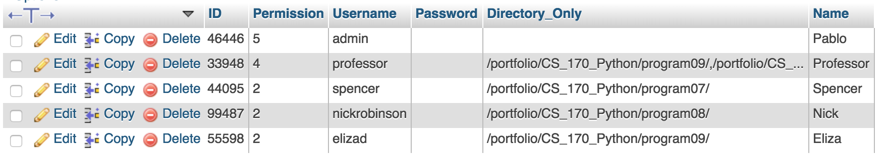
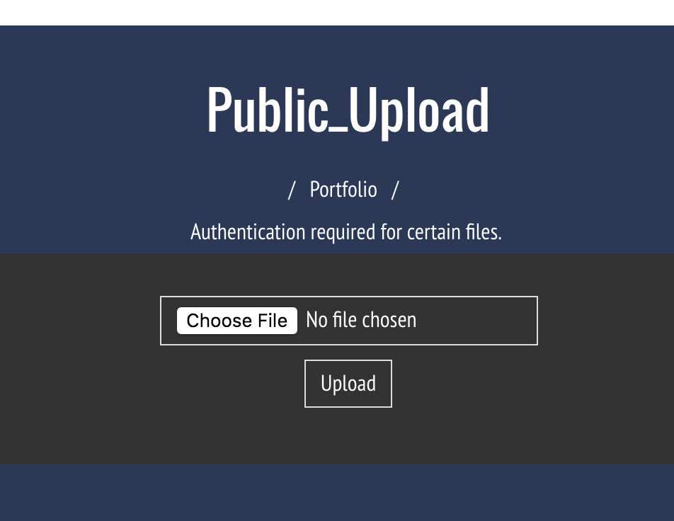
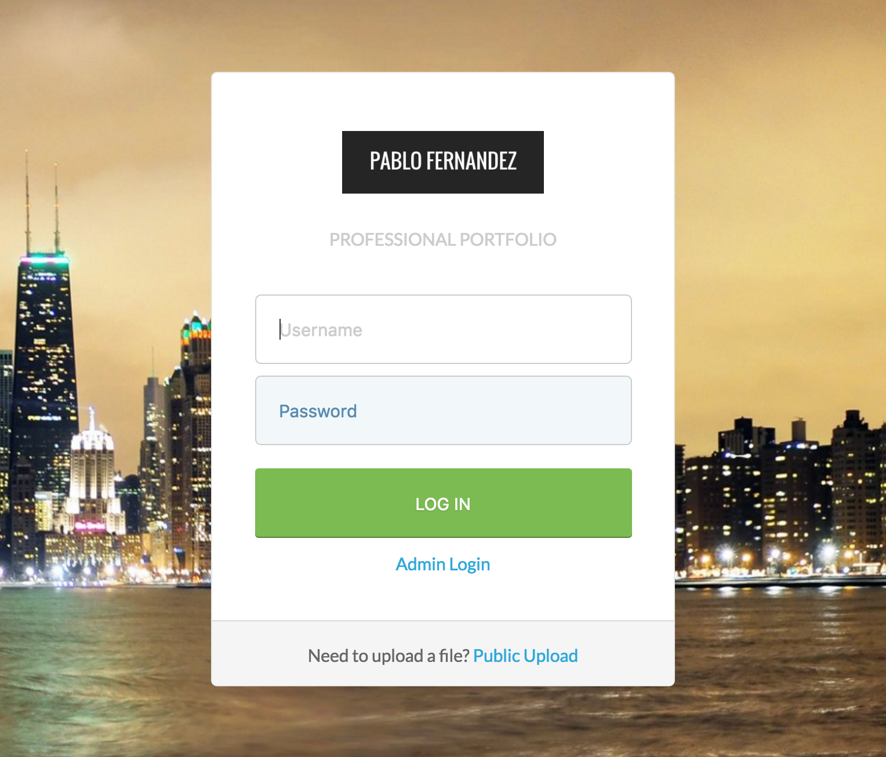

#Team-Collaborate
This is an online based sharing application that allows lab partners, professors, and other students
to share code and other projects seamlessly. Users can share file access to different directories, and
allow access to only modify certain files. 

This project fosters communication and innovation through simplyifying the collaboration process.
Currently this project  <strong>is in progress</strong>, however a working version is published below. -Pablo Fernandez

http://www.mywhitman.com/portfolio/

Team Partners
----
A MySQL database of authorized users for the application controls file and directory access.   

Public Sharing
----
Files can be shared with certain partners at any time, or can be made private.   

Secure Files
----
Files are protected to ensure that only team-members can access the files.   

Authentication Capabilities
----
Visitors are authenticated to ensure they have valid permissions for the file.   

